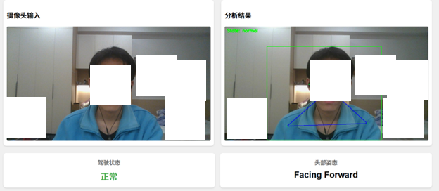

# YOLOv8 Driver State Detection System

基于YOLOv8-Pose模型的实时驾驶员疲劳状态检测系统，通过分析人体姿态关键点来判断驾驶员的疲劳程度。
if u think this is so good ,please start it.🤧🤧



## 功能特性

- **实时姿态检测**: 使用YOLOv8-Pose模型检测17个人体关键点
- **疲劳状态分析**: 分析头部姿态和坐姿，判断驾驶员疲劳程度
- **状态分级**: 将驾驶员状态分为正常、轻度疲劳和疲劳三个等级
- **系统校准**: 支持个性化校准，提高检测准确性
- **RESTful API**: 提供标准化API接口，易于集成

## 技术栈

- **后端框架**: FastAPI + Uvicorn
- **深度学习**: PyTorch + Ultralytics YOLOv8
- **计算机视觉**: OpenCV
- **数据验证**: Pydantic

## 项目结构

```
.
├── main.py                 # 应用入口
├── config.py               # 配置参数
├── analyzer.py             # 核心分析器
├── models.py               # 数据模型
├── routes.py               # API路由
├── requirements.txt        # 依赖列表
├── .gitignore             # Git忽略文件
├── yolov8n-pose.pt        # YOLOv8模型权重
└── index.html             # 前端演示页面
```

## 安装

### 环境要求

- Python 3.12
- CUDA 12.0 (可选，用于GPU加速)

### 安装依赖

```bash
pip install -r requirements.txt
```

## 使用

### 启动服务

```bash
python main.py
```

或使用uvicorn:

```bash
uvicorn main:app --host 0.0.0.0 --port 5002
```

服务将在 `http://0.0.0.0:5002` 启动。

### API接口

#### 1. 分析驾驶员状态（带标注帧）

```bash
POST /analyze_driver
Content-Type: application/json

{
  "frame_base64": "data:image/jpeg;base64,..."
}
```

#### 2. 分析驾驶员状态（无标注帧）

```bash
POST /analyze_driver_silence
Content-Type: application/json

{
  "frame_base64": "data:image/jpeg;base64,..."
}
```

#### 3. 系统校准

```bash
POST /calibrate
Content-Type: application/json

{
  "frame_base64": "data:image/jpeg;base64,..."
}
```

#### 4. 健康检查

```bash
GET /health
```

#### 5. 重置计数器

```bash
POST /reset
```

### API文档

启动服务后，可以用访问 `http://localhost:5002/docs` 去查看交互式API文档。这个是fastapi的默认提供的

## 配置

主要配置参数在 `config.py` 中：

- `YOLO_MODEL_PATH`: YOLOv8模型路径
- `CONF_THRESHOLD`: 检测置信度阈值
- `IOU_THRESHOLD`: NMS阈值
- `EYE_CONFIDENCE_THRESHOLD`: 眼部关键点置信度阈值
- `CONTINUOUS_TIRED_FRAMES`: 疲劳判定阈值

## 核心算法

### 头部姿态检测

通过分析鼻子与肩膀中点的相对位置判断：
- **抬头**: 鼻子位置高于肩膀中点
- **低头**: 鼻子位置低于肩膀中点
- **偏头**: 鼻子偏离肩膀中线
- **转头**: 双眼距离过窄

### 坐姿检测

通过分析双肩高度差判断坐姿是否端正。

### 疲劳判定

基于头部姿态和身体姿势建立疲劳累计评分模型，超过阈值判定为疲劳状态。

## 性能优化

- 支持GPU加速（CUDA）
- 使用轻量级YOLOv8n-pose模型
- 实时处理能力（30+ FPS）

## 注意事项

1. 确保光线充足，避免逆光或过暗环境
2. 首次使用建议进行系统校准
3. 模型权重文件 `yolov8n-pose.pt` 会自动下载

## 许可证

MIT License

## 贡献

欢迎提交Issue和Pull Request！